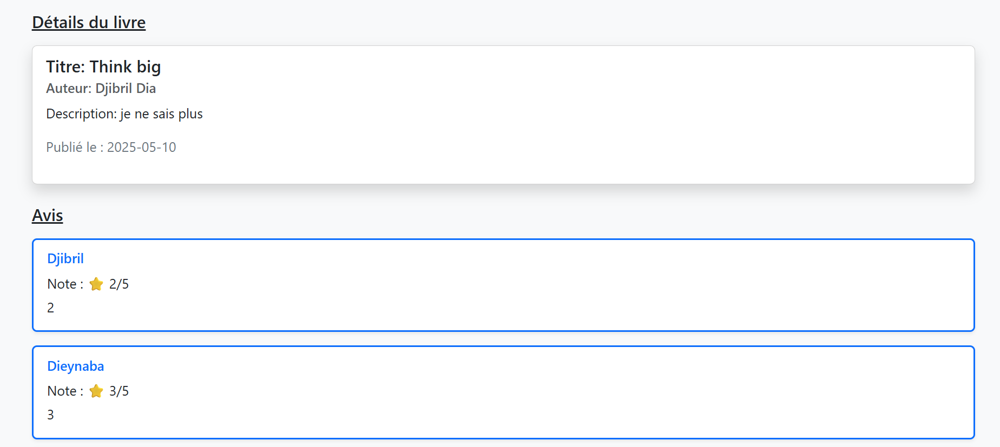
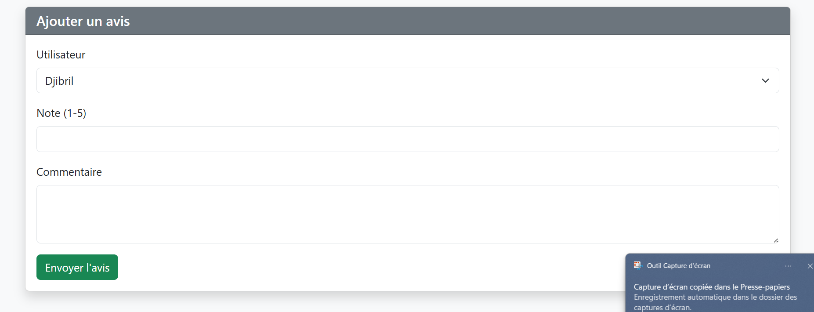

# Laravel Books & Reviews Project

## Description
Application Laravel permettant aux utilisateurs de consulter des livres et de laisser des avis. Les utilisateurs peuvent noter les livres de 1 à 5 étoiles et laisser des commentaires.

## Captures d'écran

### Page de détails d'un livre

*Page affichant les détails d'un livre avec son titre, auteur et date de publication*

### Section des avis

*Liste des avis avec les notes et commentaires des utilisateurs*

### Formulaire d'ajout d'avis

*Formulaire permettant d'ajouter un nouvel avis avec note et commentaire*

## Fonctionnalités
- Liste des livres avec leurs détails
- Vue détaillée d'un livre
- Système de notation (1-5 étoiles)
- Commentaires utilisateurs
- Relations entre livres, avis et utilisateurs

## Installation

1. Cloner le dépôt :
```bash
git clone git@github.com:DjibrilDia1/GestionDeLivresEtAvis.git
```

2. Installer les dépendances :
```bash
composer install
```

3. Configurer le fichier .env :
```bash
cp .env.example .env
php artisan key:generate
```

4. Lancer les migrations :
```bash
php artisan migrate
```

## Technologies utilisées
- Laravel 10
- PHP 8.1+
- MySQL
- Bootstrap 5

## Auteur
Djibril Dia

## Licence
MIT License